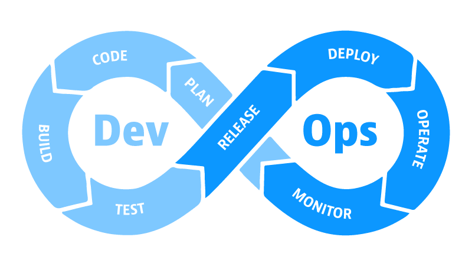

В данной лекции рассмотрим подробнее термин DevOps и попробуем ответить на вопрос "Что такое DevOps?"

Для начала обратимся к определению из англоязычной [википедии](https://en.wikipedia.org/wiki/DevOps):
```
DevOps is the integration and automation of the software development and information technology operations.
```
Предложу вольный перевод этой фразы: "DevOps — это объединение и автоматизация процессов разработки ПО и его обслуживания.".
Обычно, к этому определению прикладывают следующую картинку:


Как и большинство формальных определений, это определение слабо помогает разобраться в сущности термина, однако,
в определении мы встречаемся с двумя полезными для нас терминами: "software development" и "information technology operations" - 
рассмотрим их подробнее.

Я думаю, понятие "software development" (или сокращенно Dev) для большинства является интуитивно понятным: 
это непосредственное кодирование решения, его тестирование, создание его графической составляющей и прочие процессы,
направленные на создание конечно ПО. Все перечисленные процессы можно представить на практике: программист пишет код; 
инженер по качеству проверяет соответствию требованиям; дизайнер продумывает как приложение будет выглядеть.

Далее, рассмотрим понятие "information technology operations" (или сокращенно Ops). С этим понятием, вероятно, 
вы сталкивались реже по той причине, что понятие затрагивает процессы, характерные для жизненного цикла реального, 
развернутого программного обеспечения. Приведем несколько процессов, которые затрагивают эту сферу:
- установка и обновление приложения 
- управление конфигурацией приложения
- мониторинг приложения

При этом, в большинстве случаев каждый процесс подразумевает наличие специализации, а значит выделенной роли в компании:
- кодирование решения - программист
- тестирование ПО - QA инженер
- установка и обновление приложения - системный администратор
и так далее

Концепция, данная в изначальном определении, о том, что DevOps это объедение процессов Dev и Ops заставляет нас думать, что
DevOps это набор процессов, выполняемые отдельной ролью. На текущий момент, такой ролью принято считать DevOps инженера. 

Однако, такое представление о DevOps достаточно часто критикуется в индустрии, поскольку оно искажает изначальную идею.
Чтобы лучше 